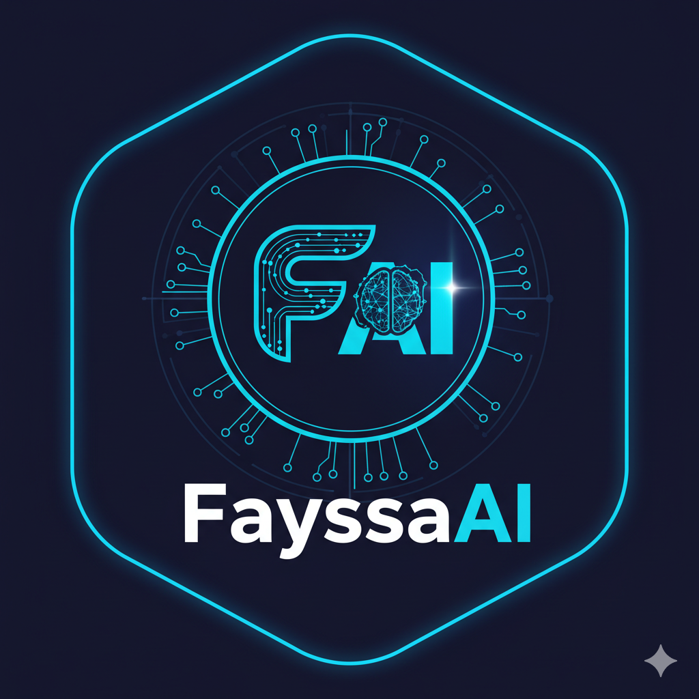

  
  
  # Hi there, I'm Fayssal Sabri! 👋
  
  
  
  
  
  
  

---

##  About Me

I'm a passionate **Data Science & AI Engineer** with a Master's degree from **Centrale Lyon & ENSAM**. I specialize in transforming complex data into actionable insights and building intelligent solutions that make a real impact.

**What drives me:**
-  **Research & Innovation**: Exploring cutting-edge AI/ML techniques
-  **Problem Solving**: Tackling complex challenges with data-driven approaches  
-  **Impact**: Creating solutions that benefit society and business
-  **Continuous Learning**: Always staying updated with the latest technologies

**Current Focus:** Deep Learning, Computer Vision, NLP, and MLOps

---

##  Key Achievements & Projects

###  **Education & Certifications**
- **Master's in Data Science & AI** - Centrale Lyon & ENSAM
- **Engineering Background** with focus on systemic thinking and problem-solving

###  **Notable Projects**
- **AI/ML Solutions**: Developed end-to-end machine learning pipelines
- **Data Engineering**: Built scalable data processing systems
- **Research**: Contributed to cutting-edge AI research projects
- **Open Source**: Active contributor to data science communities

###  **Professional Experience**
- **Data Science & AI Engineer** with expertise in multiple domains
- **Problem Solver** with a track record of delivering impactful solutions
- **Innovation Focus** on applying AI to real-world challenges

---

##  Tech Stack

###  **AI & Machine Learning**

  
  
  
  
  
  
  

###  **Development & DevOps**

  
  
  
  

###  **Web Technologies**

  
  
  

###  **Databases & Analytics**

  
  
  
  

###  **Cloud & Tools**

  
  
  
  
  

---

##  GitHub Statistics

  
  
  
  
  
  
  

---

##  Current Focus & Interests

| **Area** | **Technologies** | **Applications** |
|:--------:|:----------------:|:----------------:|
|  **Deep Learning** | PyTorch, TensorFlow, Keras | Computer Vision, NLP |
|  **Data Science** | Pandas, NumPy, Scikit-learn | Analytics, Visualization |
|  **MLOps** | Docker, Kubernetes, MLflow | Model Deployment, Monitoring |
|  **Web Development** | React, FastAPI, Node.js | Full-stack Applications |

---

## 🤝 Let's Connect!

  
  **I'm always interested in collaborating on exciting projects and discussing new opportunities!**
  
  
  
  
  
  
  ---
  
  
  

