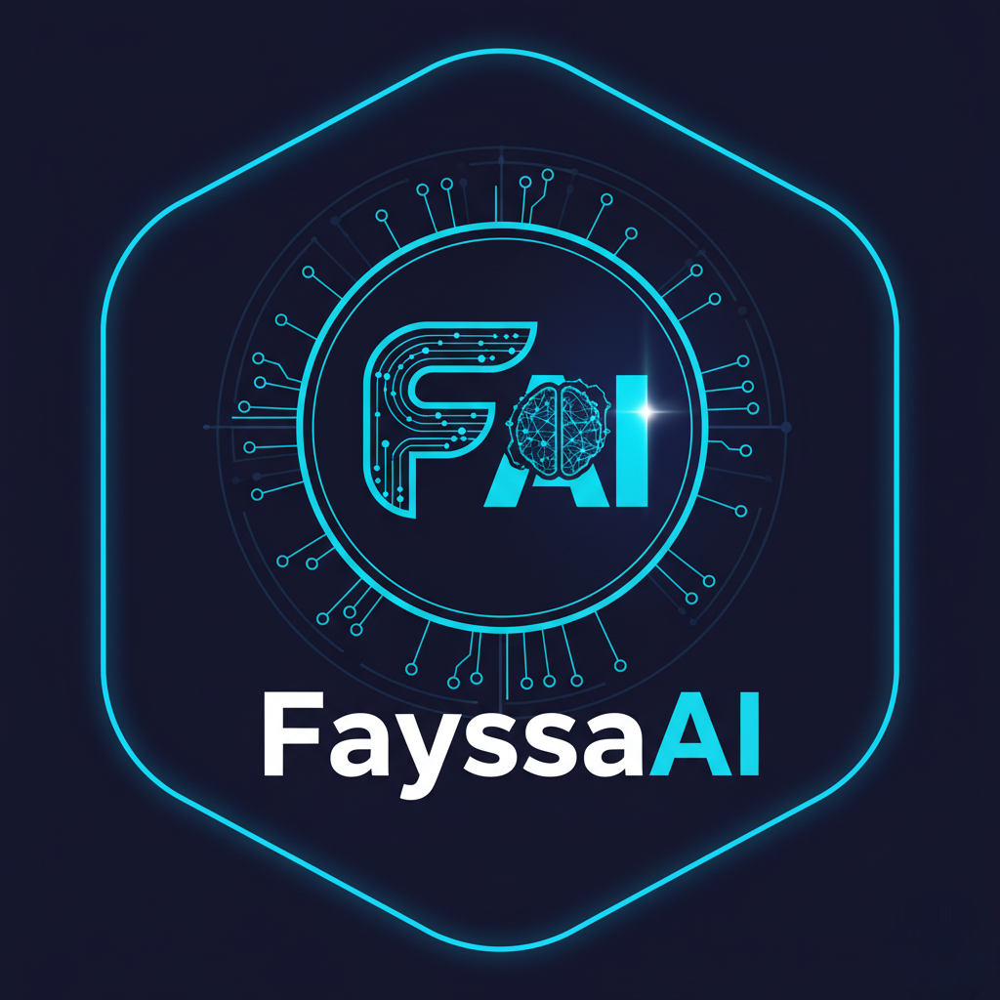

# 

  
  
  # Hi, I'm **Fayssal Sabri** 
  ###  Data Science & AI Engineer | Problem Solver
  
  

    
    
    
  

  

    
  

---

##  **About Me**

  <table>
    <tr>
      <td width="50%" align="left">
        
 **Master's in Data Science & AI** (Centrale Lyon & ENSAM)  
 **Engineer** passionate about leveraging cutting-edge technology  
 **Research Focus**: Machine Learning, Deep Learning, AI Innovation  
 **Mission**: Turning complex data into actionable insights  
 **Vision**: Building intelligent systems that make a real impact  

      </td>
      <td width="50%" align="center">
        
      </td>
    </tr>
  </table>

---

## 🛠️ **Tech Arsenal**

###  AI & Machine Learning**

  
  
  
  
  

### ** Development & DevOps**

  
  
  

### ** Web Technologies**

  
  
  

### ** Databases & Analytics**

  
  
  
  

### ** Cloud & Tools**

  
  
  
  

---

##  **GitHub Analytics**

  <table>
    <tr>
      <td width="50%">
        
      </td>
      <td width="50%">
        
      </td>
    </tr>
  </table>
  
  
  
  

---

##  **Achievements & Highlights**

  <table>
    <tr>
      <td align="center" width="33%">
        
         <strong>Data Science & AI</strong>
         <em>Centrale Lyon & ENSAM</em>
      </td>
      <td align="center" width="33%">
        
         <strong>Machine Learning</strong>
         <em>Deep Learning & MLOps</em>
      </td>
      <td align="center" width="33%">
        
         <strong>Problem Solving</strong>
         <em>Data-Driven Solutions</em>
      </td>
    </tr>
  </table>

---

## 🌐 **Let's Connect & Collaborate**

  

     <strong>Open to collaborations</strong> on innovative AI/ML projects 
     <strong>Looking for opportunities</strong> to make meaningful impact 
     <strong>Reach out</strong> for discussions about technology, research, or exciting projects
  

  
  

    
    
    
  

---

  
  
  
<em>"Turning data into intelligence, one algorithm at a time"</em>

  
  

